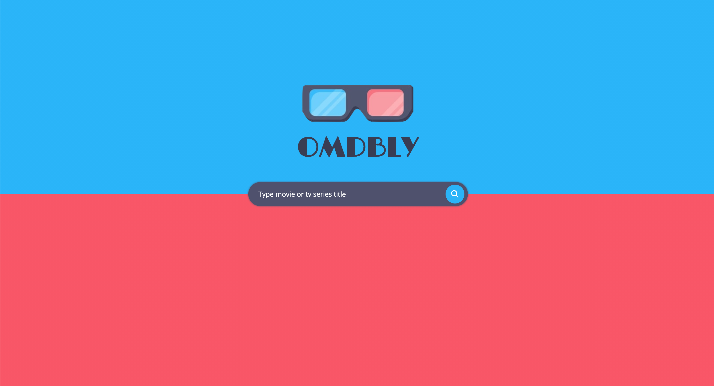

# omdbly

Simple search app using omdb rest API.

## Setup
To run the application you need to use at least nodejs 12+ with npm:
- `npm install` to install dependencies,
- `npm start` to run `webpack's dev server` to launch project locally
- alternatively, you can build the app with `npm build` and host it yourself

## Technology
The application is built using:
- `webpack` + `webpack-dev-server` and multiple plugins,
- `React`, used hooks for state management and async operations,
- `typescript` for type safety (relying way too much on type inference, not very strict),
- `styled-components`, after short battle I decided to give it anoter try
- there is `jest` setup, althrough test coverage is way far from being satisfactory. As an excuse - I did spent more time on the interface (which is my weaker point).

Todos for tech setup:
- code quality, eslint + prettier,
- more tests,
- better code split (extract UI/styled components),
- **repository contains my api key, which in normal conditions isn't safe at all** - but as this is client application only it would be best to hide this behind server abstraction.

## Product
I am happy with the final UI, I've spent some time reading about search pages patterns (in general I'm far from calling myself UI engineer) - and it's always great to learn something new.

OMDBLY - is a movie search application, utilising OMDB rest API.
Existing features are limited to searching and listing search results, with minor preparations for filtering and pagination.

Missing features that would enrich experience:
- displaying movie/tv series/episode details,
- dynamic results while typing,
- pagination or infinite scroll,
- value for logged user: keeping track of what has been watched, rating, community discussions, suggestions based on already watched,
- monetization oppourtunity: advertisements, cinema / video streaming partnerships (aka: watch this movie there 33% cheaper, see this in netflix).

## Constraints
I wanted to build minimalistic and unique application so I decided not to use any third party UI-ready library.
